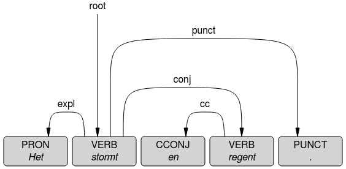

# Introductie

## Lassy

See: [Lassy Syntactische Annotatie](http://www.let.rug.nl/vannoord/Lassy/sa-man_lassy.pdf)

See: [alpino_ds.dtd](https://github.com/rug-compling/Alpino/blob/master/Treebank/alpino_ds.dtd)

## Universal Dependencies

### Representatie van UD in XML

De UD informatie wordt aan de Alpino XML toegevoegd, en wel op
meerdere manieren. De representatie is dus redundant. Dit is gedaan om
het maken van queries te vereenvoudigen.
De informatie wordt op drie plaatsen gerepresenteerd:

 1. de CoNLL-U representatie wordt als tekst binnen het element `<conllu>` toegevoegd
    (dit zal normaliter niet voor queries worden gebruikt)
 2. de UD informatie wordt als apart `<root>` element als dochter van
    `<alpino_ds>` gerepresenteerd. Deze annotatielaag is vooral handig
    als je queries over de UD-laag wilt stellen en niet verwijst naar
    de informatie in de Lassy dependentie-annotatie
 3. de UD informatie van elk woord afzonderlijk wordt ook nog eens
    weergegeven als `<ud>` element, als dochter van de `<node>` van
    datzelfde woord. Deze werkwijze vereenvoudigt queries die zowel
    naar UD-informatie als naar Lassy-informatie verwijzen.

#### Element `<conllu>`

De tekstuele CONLL-U representatie volgt [deze standaarden voor CoNLL-U](https://universaldependencies.org/format.html).
De tekst wordt ingebed in de XML binnen het element `<conllu>`. Dit
element heeft een aantal attributen: `status`, `error` en `auto`.
Deze attributen geven aan hoe de conversie naar UD heeft plaatsgevonden, en welke eventuele fouten hierbij zijn opgetreden.

Het attribuut `status` heeft de waarde `OK` als de conversie naar UD
geslaagd is. De waarde `error` geeft aan de de conversie mislukt is.

Als de conversie mislukt is bevat het attribuut `error` een
omschrijving van de fout die is opgetreden.

Wanneer de conversie automatisch is afgeleid, dan bevat het attribuut
`auto` de naam en het versienummer van de voor de conversie gebruikte software.

#### Element `<root>`

De UD informatie wordt in een makkelijk doorzoekbare vorm gerepresenteerd met het element `<root>` (twee
keer, zie beneden), als
dochter van `<alpino_ds>`. Deze `<root>` dochter heeft een
boom-structuur waarbij steeds voor elke dependency waar dit woord het
hoofd van is een dochter element wordt gebruikt. De naam van het
element is hetzelfde als het label van de dependency (minus een
eventueel deel dat begin met een dubbele punt). De overige
informatie zoals lemma en part-of-speech wordt met attributen
weergegeven. Voor de volgende zin:

> De kinderen lezen weinig boeken

levert dit bijvoorbeeld het volgdende XML-fragment op voor de normale
UD analyse (enkele minder relevante attributen (zoals de Lassy
POS-tags die hier ook nog eens verschijnen) zijn verwijderd voor de
leesbaarheid):

```xml

  <root ud="basic" id="3" form="lezen" lemma="lezen" upos="VERB" Number="Plur" Tense="Pres" VerbForm="Fin" head="0" deprel="root">
    <nsubj ud="basic" id="2" form="kinderen" lemma="kind" upos="NOUN" Number="Plur" head="3" deprel="nsubj">
      <det ud="basic" id="1" form="de" lemma="de" upos="DET" Definite="Def" head="2" deprel="det"/>
    </nsubj>
    <obj ud="basic" id="5" form="boeken" lemma="boek" upos="NOUN" Number="Plur" head="3" deprel="obj">
      <det ud="basic" id="4" form="weinig" lemma="weinig" upos="DET" head="5" deprel="det"/>
    </obj>
  </root>
```

##### Samengestelde dependency relaties

Elk element bevat het attribuut `deprel` waarvan de waarde vaak gelijk
is aan de naam van het element. Maar soms gaat het om een dependency
met een samengestelde naam, zoals `conj:en`. In dit geval heeft het
attribuut `deprel` de volledige naam, en is er een attribuut
`deprel_aux` met alleen het deel na de dubbele punt:


```xml
<conj deprel="conj:en" deprel_aux="en" ... >
```

##### Basic en enhanced dependencies

Het hoofd-element `<alpino_ds>` heeft twee keer een `<root>` als dochter.

Onder de eerste `<root>` worden de basic dependency-relaties
gerepresenteerd (gebaseerd op de kolommen `HEAD` en `DEPREL` in het
CoNLL-U-formaat). Elk element heeft hier het attribuut `ud="basic"`.

Onder de tweede `<root>` worden de enhanced dependency-relaties
gerepresenteerd (gebaseerd op de kolom `DEPS` in het
CoNLL-U-formaat).  Elk element heeft hier het attribuut `ud="enhanced"`.

```xml
<alpino_ds>

  <root ud="basic" ... >
   <nsubj ud="basic" ... > ... </nsubj>

  </root>

  <root ud="enhanced" ... >
   <nsubj ud="enhanced" ... > ... </nsubj>

  </root>

</alpino_ds>
```

##### Enhanced dependencies

Enhanced dependencies kunnen lussen bevatten, waardoor deze niet
volledig als een boom zijn weer te gegeven. In zulke gevallen wordt bij het
vormen van de boom de lus een paar keer doorlopen om langere xpath-queries in
meerdere richtingen mogelijk te maken. Maar na een paar niveaus wordt
deze recursie onderbroken. Dit wordt aangegeven met het attribuut
`recursion_limit`, zoals hier:

```xml
<obj ud="enhanced" recursion_limit="TOO DEEP" ... />
```

##### Samenvatting

Onderstaande tabel geeft een overzicht van welke elementen uit het CoNLL-U-formaat waar in Alpino terecht komen.


|         veld   | voorbeeld  |   attribuut | voorbeeld |
|----------------|------------|----------------|-----------|
|   1     ID     | 3          |   id        | `id="3"` |
|                | 5.1        |   id        | `id="5.1"` |
|   2     FORM   | Het        |   form      | `form="Het"` |
|   3     LEMMA  | het        |   lemma     | `lemma="het"` |
|   4     UPOS   | PRON       |   upos      | `upos="PRON"` |
|   5     XPOS   | VNW\|pers\|pron |   *geen* | |
|   6     FEATS  | Person=3\|PronType=Prs |   *als gegeven, gesplitst* | `Person="3" PronType="Prs"` |
|   7     HEAD   | 2          |   head      | `head="2"` |
|   8     DEPREL | conj       |   *zie →*   | `<conj ud="basic" deprel="conj" >` |
|                | conj:en    |   *zie →*   | `<conj ud="basic" deprel="conj:en" deprel_aux="en" >` |
|   9     DEPS   | 2:conj     |   *zie →*   | `<conj ud="enhanced" head="2" deprel="conj" >` |
|                | 2:conj:en  |   *zie →*   | `<conj ud="enhanced" head="2" deprel="conj:en" deprel_aux="en" >` |
|  10     MISC   | SpaceAfter=No |   *geen* | |


#### Elementen `<ud>` per woord

Naast de hierboven gepresenteerde representatie van de UD informatie wordt
diezelfde informatie op een redundante manier ook gerepresenteerd als
dochters van de lexicale knopen in de Lassy analyse.

Voor elke lexicale knoop in de Lassy analyse (dus `<node>` met waardes
voor onder andere postag, lemma, word) is er een speciaal `<ud>`
element dat de UD informatie van het betreffende woord bevat. De
lokale informatie zoals part-of-speech en lemma wordt gerepresenteerd
als attributen van `<ud>`. Ook het hoofd, en de naam van de dependency dat dit
woord met haar hoofd heeft wordt hier gerepresenteerd.

De waarde van het attribuut `id` van het element `<ud>` is altijd
gelijk aan de waarde van het attribuut `end` van het element `<node>`.
Dit is het woord-index, `ID` in het CoNLL-U-formaat.

Dit ziet er dus schematisch als volgt uit voor het woord "kinderen" uit het eerder gegeven voorbeeld:
```xml
<node begin="1" end="2" id="4" lemma="kind" postag="N(soort,mv,basis)" rel="hd" word="kinderen">
  <ud id="2" form="kinderen" lemma="kind" upos="NOUN" head="3" deprel="nsubj" deprel_main="nsubj">
   ...
  </ud>
</node>
```

##### Enhanced dependencies: `<dep>` per woord

Daarnaast bevat `<ud>` dochter-elementen `<dep>`, een voor elk van de **enhanced** dependencies waarvan dit woord
het hoofd is.  Voor het hiervoor
gegeven voorbeeld is dit het (vereenvoudigde) XML-fragment dat behoort
bij het woord "kinderen":


```xml
<node begin="1" end="2" id="4" lemma="kind" postag="N(soort,mv,basis)" rel="hd" word="kinderen">
  <ud id="2" form="kinderen" lemma="kind" upos="NOUN" head="3" deprel="nsubj" deprel_main="nsubj">
    <dep id="2" head="3" deprel="nsubj" deprel_main="nsubj"/>
  </ud>
</node>
```

##### Samengestelde dependency relaties

Zowel `<ud>` als `<dep>` heeft een attribuut `deprel` dat de
volledige naam van de dependency bevat. Het attribuut `deprel_main` heeft als waarde
het eerste deel van de naam van de dependency wanneer het om een
samengestelde naam gaat, of is gelijk aan `deprel` als het geen
samengestelde naam is. Wanneer het wel om een samengestelde naam gaat,
dan is er een attribuut `deprel_aux` dat het tweede deel van de naam
bevat. Bijvoorbeeld:

```xml
<ud ... deprel="compound:prt" deprel_main="compound" deprel_aux="prt" ... >
  <dep ... deprel="compound:prt" deprel_main="compound" deprel_aux="prt" ... />
</ud>
```

##### Ingevoegde woorden in enhanced dependencies

Voor het attribuut `id` van het element `<dep>` geldt hetzelfde, maar
soms is er een afwijkende waarde, met een punt er in. Hier gaat het om
een relatie van een ingevoegd woord dan een kopie is van het woord
waar `<node>` naar verwijst. In dit geval heeft `<dep>` ook het
attribuut `elided`, zoals hier:

```xml
<node end="3" ... >
  <ud id="3" ... >
    <dep id="3" ... />
    <dep id="5.1" elided="true" .../>
  </ud>
</node>
```

Deze ingevoegde woorden worden bijvoorbeeld gebruikt in elliptische constructies waar een woord optreedt als hoofd van
twee woordgroepen. Een voorbeeld is de volgende zin uit Lassy Small:

> De Britten maakten de Tortoise , de Amerikanen de T-95 .

De analyse van dit voorbeeld volgens de enhanced dependency annotatielaag neemt aan dat `maakten` niet alleen het hoofd is van de eerste conjunct, maar ook fungeert
als hoofd van `de Amerikanen` en `de T-95`. Dit is de illustratie van de enhanced dependency analyse:


Dit wordt dus aangegeven als volgt (opnieuw wat vereenvoudigd), waarbij we ons hier beperken tot de informatie voor de woorden `maakten` en `Amerikanen`:

```xml
<node begin="2" end="3" index="1" lemma="maken" rel="hd" word="maakten">
 <ud id="3" form="maakten" lemma="maken" upos="VERB" head="0" deprel="root">
  <dep id="3" head="0" deprel="root"/>
  <dep id="6.1" head="3" deprel="conj" elided="true"/>
 </ud>
</node>
...
<node begin="7" end="8" lemma="Amerikaan" rel="hd" word="Amerikanen">
 <ud id="8" form="Amerikanen" lemma="Amerikaan" upos="PROPN" head="3" deprel="conj">
  <dep id="8" head="6.1" deprel="nsubj"/>
 </ud>
</node>
```

##### Samenvatting

Onderstaande tabel geeft een overzicht van welke elementen uit het CoNLL-U-formaat waar in Alpino terecht komen.

|         veld   | voorbeeld  | tag/attribuut | voorbeeld |
|----------------|------------|----------------|-----------|
|   1    ID     | 3          |  ud/id, dep/id | `<ud id="3" > <dep id="3"> </ud>` |
|                | 5.1        |   dep/id+elided | `<ud > <dep id="5.1" elided="true"> </ud>` |
|   2     FORM   | Het        |   ud/form       | `<ud form="Het" >` |
|   3     LEMMA  | het        |   ud/lemma      | `<ud lemma="het" >` |
|   4     UPOS   | PRON       |   ud/upos       | `<ud upos="PRON" >` |
|   5     XPOS   | VNW\|pers\|pron |   *geen*   | |
|   6     FEATS  | Person=3\|PronType=Prs |   *als gegeven, gesplitst* | `<ud Person="3" PronType="Prs" >` |
|   7     HEAD   | 2          |   ud/head       | `<ud head="2" >` |
|   8     DEPREL | conj       |   ud/*zie →*    | `<ud="basic" deprel="conj" deprel_main="conj" >` |
|                | conj:en    |   ud/*zie →*    | `<ud="basic" deprel="conj:en" deprel_main="conj" deprel_aux="en" >` |
|   9     DEPS   | 2:conj     |   dep/*zie →*   | `<ud> <dep head="2" deprel="conj" deprel_main="conj" > </ud>` |
|                | 2:conj:en  |   dep/*zie →*   | `<ud> <dep head="2" deprel="conj:en" deprel_main="conj" deprel_aux="en" > </ud>` |
|  10     MISC   | SpaceAfter=No |   *geen*     | |


#### Compleet voorbeeld

Alles tezamen wordt het volgende voorbeeld als volgt in XML gerepresenteerd:

> Het stormt en regent.

```xml
<?xml version="1.0"?>
<alpino_ds version="1.10">

  <node begin="0" end="5" id="0" rel="top" cat="top">
    <node begin="0" end="4" id="1" rel="--" cat="conj">
      <node begin="0" end="2" id="2" rel="cnj" cat="smain">
        <node begin="0" end="1" id="3" index="1" lemma="het"
              postag="VNW(pers,pron,stan,red,3,ev,onz)" pt="vnw" rel="su"
              word="Het" frame="het_noun" genus="onz" getal="ev" his="normal"
              his_1="decap" his_1_1="normal" lcat="np" naamval="stan"
              pdtype="pron" persoon="3" pos="noun" rnum="sg" root="het"
              sense="het" special="het" status="red" vwtype="pers">
          <ud id="1" form="Het" lemma="het" upos="PRON" Person="3"
              PronType="Prs" head="2" deprel="expl" deprel_main="expl">
            <dep id="1" head="2" deprel="expl" deprel_main="expl"/>
            <dep id="1" head="4" deprel="nsubj" deprel_main="nsubj"/>
          </ud>
        </node>
        <node begin="1" end="2" id="4" lemma="stormen" postag="WW(pv,tgw,met-t)"
              pt="ww" rel="hd" word="stormt" frame="verb(hebben,sg3,het_subj)"
              his="normal" his_1="normal" infl="sg3" lcat="smain" pos="verb"
              pvagr="met-t" pvtijd="tgw" root="storm" sc="het_subj"
              sense="het-storm" tense="present" wvorm="pv">
          <ud id="2" form="stormt" lemma="stormen" upos="VERB" Number="Sing"
              Tense="Pres" VerbForm="Fin" head="0" deprel="root"
              deprel_main="root">
            <dep id="2" head="0" deprel="root" deprel_main="root"/>
          </ud>
        </node>
      </node>
      <node begin="2" end="3" id="5" lemma="en" postag="VG(neven)" pt="vg"
            rel="crd" word="en" conjtype="neven" frame="conj(en)" his="normal"
            his_1="normal" lcat="vg" pos="vg" root="en" sense="en">
        <ud id="3" form="en" lemma="en" upos="CCONJ" head="4" deprel="cc"
            deprel_main="cc">
          <dep id="3" head="4" deprel="cc" deprel_main="cc"/>
        </ud>
      </node>
      <node begin="0" end="4" id="6" rel="cnj" cat="ssub">
        <node begin="0" end="1" id="7" index="1" rel="su"/>
        <node begin="3" end="4" id="8" lemma="regenen" postag="WW(pv,tgw,met-t)"
              pt="ww" rel="hd" word="regent" frame="verb(hebben,sg3,het_subj)"
              his="normal" his_1="normal" infl="sg3" lcat="ssub" pos="verb"
              pvagr="met-t" pvtijd="tgw" root="regen" sc="het_subj"
              sense="het-regen" tense="present" wvorm="pv">
          <ud id="4" form="regent" lemma="regenen" upos="VERB" Number="Sing"
              Tense="Pres" VerbForm="Fin" head="2" deprel="conj" deprel_main="conj">
            <dep id="4" head="2" deprel="conj:en" deprel_main="conj"
                 deprel_aux="en"/>
          </ud>
        </node>
      </node>
    </node>
    <node begin="4" end="5" id="9" lemma="." postag="LET()" pt="let" rel="--"
          word="." frame="punct(punt)" his="normal" his_1="normal" lcat="punct"
          pos="punct" root="." sense="." special="punt">
      <ud id="5" form="." lemma="." upos="PUNCT" head="2" deprel="punct"
          deprel_main="punct">
        <dep id="5" head="2" deprel="punct" deprel_main="punct"/>
      </ud>
    </node>
  </node>

  <sentence sentid="0000/0000">Het stormt en regent .</sentence>

  <root ud="basic" id="2" form="stormt" lemma="stormen" upos="VERB"
        Number="Sing" Tense="Pres" VerbForm="Fin" head="0" deprel="root" pt="ww"
        pvagr="met-t" pvtijd="tgw" wvorm="pv">
    <expl ud="basic" id="1" form="Het" lemma="het" upos="PRON" Person="3"
          PronType="Prs" head="2" deprel="expl" genus="onz" getal="ev"
          naamval="stan" pdtype="pron" persoon="3" pt="vnw" status="red"
          vwtype="pers"/>
    <conj ud="basic" id="4" form="regent" lemma="regenen" upos="VERB"
          Number="Sing" Tense="Pres" VerbForm="Fin" head="2" deprel="conj"
          pt="ww" pvagr="met-t" pvtijd="tgw" wvorm="pv">
      <cc ud="basic" id="3" form="en" lemma="en" upos="CCONJ" head="4"
          deprel="cc" conjtype="neven" pt="vg"/>
    </conj>
    <punct ud="basic" id="5" form="." lemma="." upos="PUNCT" head="2"
           deprel="punct" pt="let"/>
  </root>

  <root ud="enhanced" id="2" form="stormt" lemma="stormen" upos="VERB"
        Number="Sing" Tense="Pres" VerbForm="Fin" head="0" deprel="root" pt="ww"
        pvagr="met-t" pvtijd="tgw" wvorm="pv">
    <expl ud="enhanced" id="1" form="Het" lemma="het" upos="PRON" Person="3"
          PronType="Prs" head="2" deprel="expl" genus="onz" getal="ev"
          naamval="stan" pdtype="pron" persoon="3" pt="vnw" status="red"
          vwtype="pers"/>
    <conj ud="enhanced" id="4" form="regent" lemma="regenen" upos="VERB"
          Number="Sing" Tense="Pres" VerbForm="Fin" head="2" deprel="conj:en"
          deprel_aux="en" pt="ww" pvagr="met-t" pvtijd="tgw" wvorm="pv">
      <nsubj ud="enhanced" id="1" form="Het" lemma="het" upos="PRON" Person="3"
             PronType="Prs" head="4" deprel="nsubj" genus="onz" getal="ev"
             naamval="stan" pdtype="pron" persoon="3" pt="vnw" status="red"
             vwtype="pers"/>
      <cc ud="enhanced" id="3" form="en" lemma="en" upos="CCONJ" head="4"
          deprel="cc" conjtype="neven" pt="vg"/>
    </conj>
    <punct ud="enhanced" id="5" form="." lemma="." upos="PUNCT" head="2"
           deprel="punct" pt="let"/>
  </root>

  <conllu status="OK"><![CDATA[
1  Het     het      PRON   VNW|pers|pron|stan|red|3|ev|onz  Person=3|PronType=Prs                2  expl   2:expl|4:nsubj  _
2  stormt  stormen  VERB   WW|pv|tgw|met-t                  Number=Sing|Tense=Pres|VerbForm=Fin  0  root   0:root          _
3  en      en       CCONJ  VG|neven                         _                                    4  cc     4:cc            _
4  regent  regenen  VERB   WW|pv|tgw|met-t                  Number=Sing|Tense=Pres|VerbForm=Fin  2  conj   2:conj:en       _
5  .       .        PUNCT  LET                              _                                    2  punct  2:punct         _
]]></conllu>

</alpino_ds>
```


Basic dependency-relaties:



Enhanced dependency-relaties, waarin de verschillen met de vorige
figuur blauw zijn gemarkeerd:


